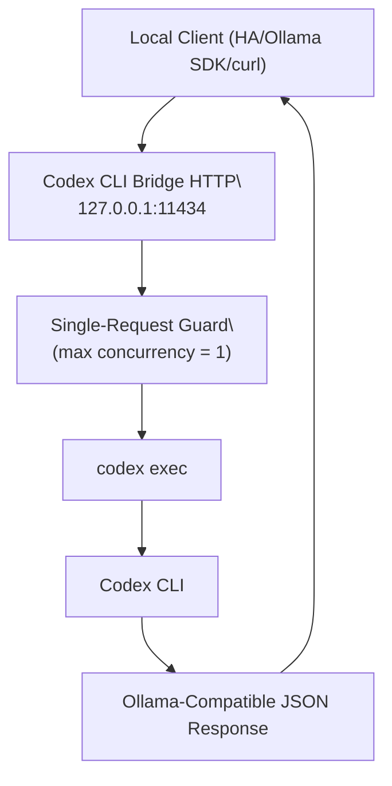

# Codex CLI Bridge

Standalone Codex CLI bridge with an Ollama-compatible HTTP surface.

Default contract:

- localhost-only bind (`127.0.0.1`)
- no auth (local trusted environments)
- single-request runtime mode (no stream, no parallel execution)

## Runtime Diagram



## API Surface

- `GET /healthz`
- `GET /api/version`
- `GET /api/tags`
- `GET /api/ps`
- `POST /api/show`
- `POST /api/pull`
- `POST /api/generate`
- `POST /api/chat`

Behavior:

- `stream=true` is rejected for `/api/generate` and `/api/chat`.
- Only one active Codex execution is allowed (`429 busy` when occupied).

## Git Source Run

```bash
git clone https://github.com/thanhn062/codex-cli-bridge.git
cd codex-cli-bridge
npm install
npm run build
npm start
```

## Deployment Options

- Docker
- systemd user unit (`systemctl --user`)
- systemd system unit (`sudo systemctl`)

## Configuration

Primary environment variables:

- `CODEX_CLI_BRIDGE_HOST` (default: `127.0.0.1`)
- `CODEX_CLI_BRIDGE_PORT` (default: `11434`)
- `CODEX_CLI_BRIDGE_MODEL` (default: `codex`)
- `CODEX_CLI_BRIDGE_CODEX_BIN` (default: `codex`)
- `CODEX_CLI_BRIDGE_CODEX_EXTRA_ARGS` (comma-separated)
- `CODEX_CLI_BRIDGE_CODEX_FORMAT` (`text`, `json`, `jsonl`; default: `text`)
- `CODEX_CLI_BRIDGE_TIMEOUT_SECONDS` (default: `90`)
- `CODEX_CLI_BRIDGE_MAX_BODY_BYTES` (default: `32768`)
- `CODEX_CLI_BRIDGE_MAX_CONCURRENT_REQUESTS` (default: `1`)

CLI flags:

```bash
node dist/index.js --help
```

## Docker

```bash
docker build -t codex-cli-bridge:local .

docker run --rm --network host \
  --env-file .env.example \
  -e CODEX_CLI_BRIDGE_HOST=127.0.0.1 \
  -e CODEX_CLI_BRIDGE_PORT=11434 \
  -v "$HOME/.codex:/home/node/.codex" \
  codex-cli-bridge:local
```

`docker-compose.yml` is included.

## systemd (User Unit)

Unit template: `systemd/codex-cli-bridge.service`

```bash
mkdir -p ~/.config/systemd/user
cp systemd/codex-cli-bridge.service ~/.config/systemd/user/
cp .env.example ~/.config/codex-cli-bridge.env
systemctl --user daemon-reload
systemctl --user enable --now codex-cli-bridge.service
```

## systemd (System Unit)

Unit template: `systemd/codex-cli-bridge.system.service`

```bash
sudo cp systemd/codex-cli-bridge.system.service /etc/systemd/system/codex-cli-bridge.service
sudo cp .env.example /etc/default/codex-cli-bridge
sudo systemctl daemon-reload
sudo systemctl enable --now codex-cli-bridge.service
```

After copying, edit `/etc/systemd/system/codex-cli-bridge.service` and set:

- `User` and `Group`
- `WorkingDirectory`
- `ExecStart` path

## Smoke Test

```bash
curl -s http://127.0.0.1:11434/api/tags

curl -s http://127.0.0.1:11434/api/generate \
  -H 'Content-Type: application/json' \
  -d '{"model":"codex","prompt":"Say hello in one short sentence.","stream":false}'
```

## Security Model

- Designed for trusted localhost use.
- No auth by default.
- If exposed beyond localhost, put it behind your own auth/reverse proxy.

## License

MIT
