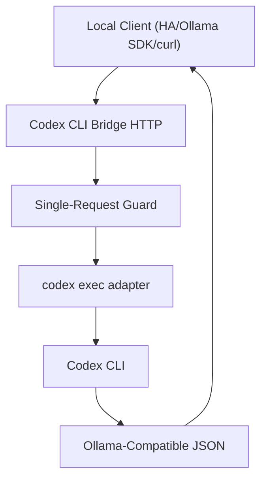

# Codex CLI Bridge Flowchart

This diagram reflects the public shape of the standalone bridge runtime.

## Reading The Diagram

- Bridge owns HTTP compatibility plus execution limits.
- Codex CLI remains the worker process.
- Calling clients are external to the bridge and remain user-chosen.

## Boundary

Codex CLI Bridge should not prescribe orchestration, memory, or automation stack choices.
